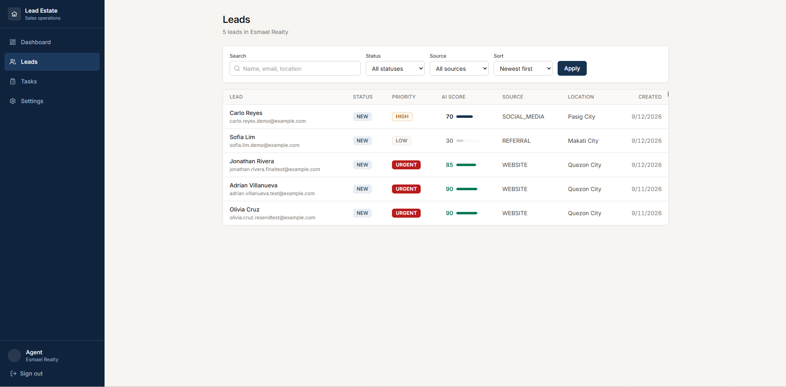
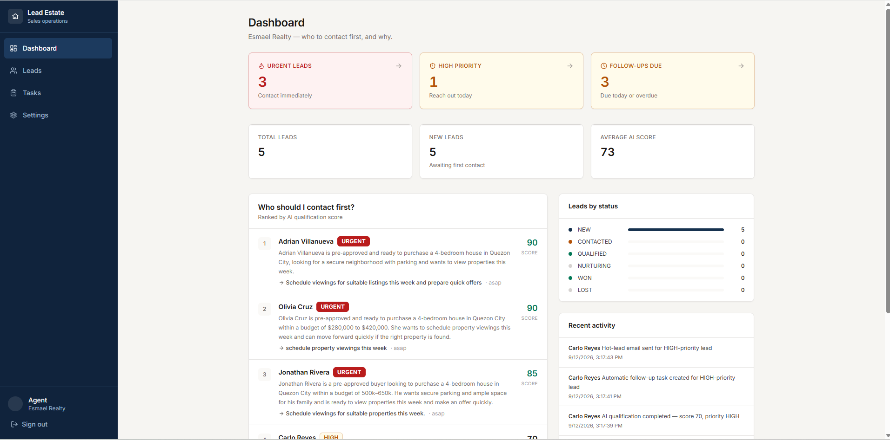
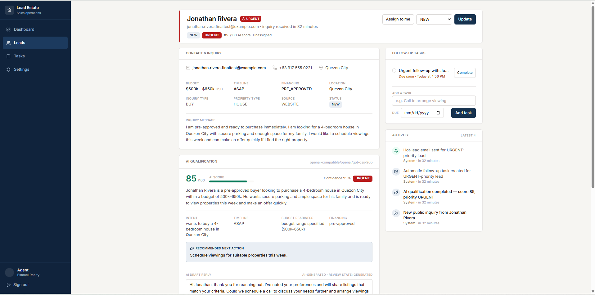
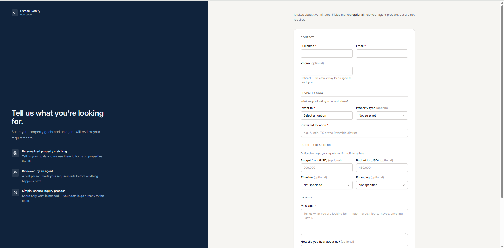
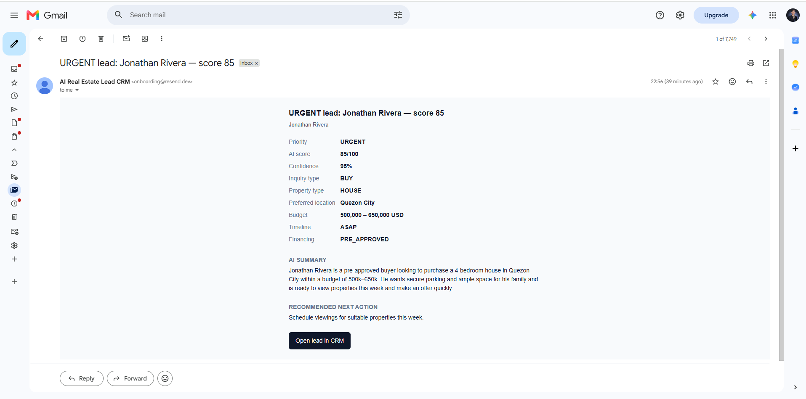

# Lead Estate — AI Real Estate Lead CRM

A production-deployed AI-assisted CRM for real estate agents and small teams. Lead Estate captures property inquiries, automatically qualifies each lead, ranks sales opportunities, creates follow-up tasks for high-value leads, and sends hot-lead email alerts so agents know who to contact first.

**Live app:** https://ai-real-estate-lead-crm.vercel.app  
**Public inquiry demo:** https://ai-real-estate-lead-crm.vercel.app/lead/esmael-realty

> Portfolio project built around a practical sales problem: incoming real-estate leads do not have equal value, and agents need a fast way to identify the opportunities most likely to convert.

## Product workflow

```text
Public property inquiry
        ↓
Lead saved to the correct workspace
        ↓
Automatic AI qualification
        ↓
Score + priority + intent + summary
        ↓
Recommended next action + draft reply
        ↓
HIGH / URGENT → automatic follow-up task
        ↓
HIGH / URGENT → hot-lead email notification
        ↓
Human review, outreach, notes, and status updates
```

The CRM remains usable if the AI provider is unavailable. Lead capture is persisted first, AI qualification runs afterward, and manual qualification remains available as a fallback.

## Screenshots

### AI-prioritized lead pipeline



Leads are ranked using structured AI qualification. The demo dataset intentionally includes different levels of sales readiness, from a LOW-score exploratory lead to HIGH and URGENT purchase-ready opportunities.

### Sales dashboard



The dashboard surfaces urgent leads, high-priority opportunities, follow-ups due, average AI score, contact-first ranking, status distribution, and recent activity.

### Lead intelligence and action workflow



Each lead has contact and inquiry details, AI score and confidence, priority, structured qualification, recommended next action, draft reply, follow-up tasks, and an activity timeline.

### Workspace-specific public inquiry form



Each organization has its own public lead-capture route. The workspace is resolved server-side from the URL slug so the browser never chooses an organization ID directly.

### Hot-lead email alert



HIGH and URGENT leads trigger a best-effort email notification with the qualification summary and a direct link back to the CRM.

## What problem it solves

Real estate agents may receive leads from websites, social media, referrals, advertisements, and property portals. Reviewing every inquiry manually creates delay and makes it easy to miss the strongest opportunities.

Lead Estate turns an incoming inquiry into actionable sales intelligence:

- **AI score** from 0–100
- **Priority**: LOW, MEDIUM, HIGH, or URGENT
- **Intent** and concise lead summary
- **Timeline**, budget readiness, and financing status
- **Recommended next action**
- **AI-generated draft reply** for human review
- **Automatic follow-up task** for HIGH / URGENT leads
- **Email alert** for HIGH / URGENT leads

The goal is not autonomous sales. The AI helps prioritize and prepare; the agent stays in control.

## Core features

### Multi-tenant authentication and workspaces

- Credentials authentication with protected application routes
- Organization and membership model
- OWNER and MEMBER roles
- Self-service sign-up provisions the user's initial workspace
- Server-side tenant isolation for workspace-owned CRM records

### Public lead capture

- Workspace-specific route: `/lead/[organizationSlug]`
- Unknown workspace slugs return 404
- Name, email, phone, inquiry type, property type, location, budget, timeline, financing, message, and source
- Lead persistence is not dependent on AI availability
- Automatic AI qualification runs after successful submission

### Lead CRM

- Lead list and lead detail views
- Search, filtering, and sorting
- Lead status workflow: `NEW`, `CONTACTED`, `QUALIFIED`, `NURTURING`, `WON`, `LOST`
- Assignment
- Notes
- Follow-up tasks
- Activity history

### AI qualification

The AI provider returns structured, validated output containing:

- score
- priority
- intent
- summary
- timeline
- budget readiness
- financing status
- recommended action
- draft reply
- confidence

Provider failures, malformed output, timeouts, or rate limits do not delete or invalidate the lead. Failed qualification attempts are recorded and can be retried manually.

### Automatic follow-up tasks

When qualification succeeds:

- **HIGH** → follow-up task due in 24 hours
- **URGENT** → urgent follow-up task due in 2 hours
- LOW / MEDIUM → no automatic task
- repeated qualification does not create duplicate automatic tasks

### Hot-lead email notifications

For HIGH / URGENT leads:

- notification is sent through Resend
- assigned user is preferred when valid for the workspace
- otherwise OWNER member(s) receive the alert
- notifications are idempotent per qualification
- email failure never breaks lead capture or qualification

### Human review

AI draft responses support the states:

- `GENERATED`
- `EDITED`
- `APPROVED`
- `REJECTED`

No outbound customer reply is sent automatically by the MVP.

## Tech stack

| Area | Technology |
| --- | --- |
| Framework | Next.js 16 App Router |
| UI | React 19, Tailwind CSS 4, Lucide React |
| Language | TypeScript |
| Authentication | NextAuth credentials flow |
| Database | PostgreSQL on Neon |
| ORM | Prisma 7 + `@prisma/adapter-pg` |
| Validation | Zod |
| AI | Configurable OpenAI-compatible provider abstraction |
| Email | Resend |
| Testing | Vitest |
| Deployment | Vercel |

## Architecture

The project uses a modular monolith structure with clear separation between presentation, server actions/routes, application services, validation, authentication, database access, and AI qualification.

A central architectural rule is that the **CRM is the primary system and AI is an enhancement**. The application is designed so that lead capture and normal CRM operations continue even when the model provider is unavailable.

### Tenant isolation

Workspace-owned records carry `organizationId`, including:

- `Lead`
- `LeadQualification`
- `LeadNote`
- `FollowUpTask`
- `Activity`

Protected operations enforce workspace membership server-side. Public lead capture uses the organization slug in the route and resolves it to a trusted organization server-side; client-supplied organization IDs are not trusted.

## Production verification

The deployed application has been verified end-to-end on Vercel with Neon PostgreSQL and Resend:

```text
Public inquiry submitted
→ lead persisted to Esmael Realty
→ automatic AI qualification completed
→ score and URGENT priority persisted
→ recommended next action generated
→ draft reply generated
→ automatic urgent follow-up task created
→ hot-lead notification sent
→ Gmail delivery confirmed
```

The production build also passed TypeScript, ESLint, build verification, route smoke testing, authentication checks, tenant-isolation tests, CRM mutation tests, AI failure/retry tests, and the project's **116-test baseline**.

## Run locally

### 1. Install dependencies

```bash
npm install
```

### 2. Configure environment

Copy the example environment file and provide your own values. Never commit real secrets.

```bash
cp .env.example .env
```

Core configuration includes database and auth settings, plus optional runtime AI and Resend settings.

### 3. Apply the database migration and seed fictional demo data

```bash
npx prisma migrate dev
npm run db:seed
```

### 4. Start development

```bash
npm run dev
```

Useful verification commands:

```bash
npm run typecheck
npm run lint
npm test
npm run build
```

## Project documentation

The repository includes additional engineering documentation:

- `AI_CONTEXT.md` — project scope, AI rules, and implementation constraints
- `ARCHITECTURE.md` — application layers, request flows, tenancy, and AI architecture
- `DECISIONS.md` — architecture and product decisions
- `TASKS.md` — implementation plan and project phases
- `SESSION_REPORT.md` — verification notes and completed work
- `.env.example` — documented environment configuration

## MVP boundaries

The current product intentionally does **not** include:

- MLS or property-portal integrations
- automated SMS
- automatic customer email replies
- voice calling
- calendar booking
- billing
- RAG / vector search
- autonomous agents
- advanced analytics

These are potential future extensions, not claims of the current build.

## Status

**Production deployed and end-to-end verified.**

The implemented MVP includes multi-tenant authentication, workspace-specific public lead capture, automatic AI qualification, lead scoring and prioritization, human-reviewed AI drafts, automatic high-value follow-up tasks, hot-lead email alerts, CRM notes/activity/status management, and dashboard contact-first ranking.
